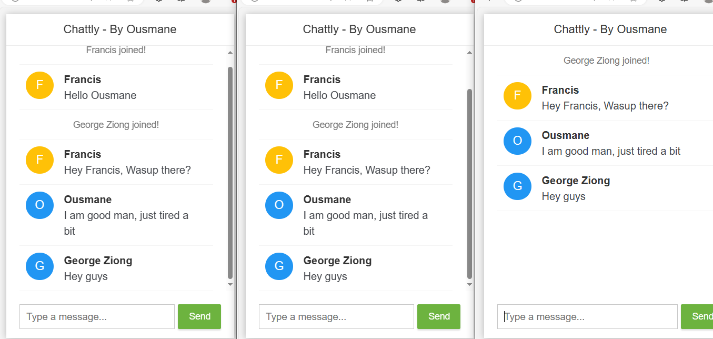

# Complete DevOps with Spring boot: Building a simple chat application

This guide provides step-by-step details to set up an end-to-end Jenkins pipeline for a Java application using SonarQube, Argo CD and Kubernetes.

## Technologies Used:
1. Openjdk 17
2. Maven
3. Spring Web socket
4. Docker for containerizing our 
5. Kubernetes for deploying our application
6. Argo CD we use the argo cd operator to deploy our application to the kubernetes cluster
7. SonarQube for static code analysis
8. Jenkins for building a complete CICD pipeline 
9. AWS(Amazon Web Services) - EC2 instances, IAM, Security management
Multiple user, roles and group management

# Steps to implement the CICD pipeline
#### NB: I used AWS EC2 instance in this project, but you can do everything locally if you want
1. Install the necessary Jenkins plugins:
* Git plugin 
* Maven Integration plugin(here we are using a docker image which has maven pre-installed so this is optional)
* Docker Pipeline plugin 
* Sonarqube scanner plugin

2. Create a new Jenkins pipeline:
* In Jenkins, create a new pipeline job and configure it with the Git repository URL for the Java application.
* Add a Jenkinsfile to the Git repository to define the pipeline stages.

3. Configure Jenkins pipeline stages:
* Stage 1: Use the Git plugin to check out the source code from the Git repository. 
* Stage 2: Use the Maven Integration plugin to build the Java application. 
* Stage 3: Use the SonarQube plugin to analyze the code quality of the Java application. 
* Stage 4: Use the Maven Integration plugin to package the application into a JAR file. 
* Stage 5: Use Argo CD to deploy the application onto a kubernetes cluster(here we are using 2 replica pods).

4. Configure Jenkins pipeline to integrate with Argo CD
* Add the Argo CD API token to Jenkins credentials. 
* Update the Jenkins pipeline to include the Argo CD deployment stage.

5. Run the Jenkins pipeline
* Trigger the Jenkins pipeline to start the CI/CD process for the Java application. 
* Monitor the pipeline stages and fix any issues that arise.

# Snapshots
1. This screenshot showcases the ArgoCD user interface displaying the status of the application deployments. It provides a visual representation of the application's health, sync status, and other relevant details.

2. This image shows the Kubernetes secret created for ArgoCD. This secret is used to store sensitive information like passwords, tokens, or keys. Kubernetes uses base64 encoded secrets which will generate you a password for your ArgoCD UI and you can proceed with 'admin' as the username.

3. This screenshot displays the ArgoCD ServiceAccount edit page. It shows the permissions and roles associated with the ServiceAccount. Navigate to "type" where the cursor is located at change it to NodePort for accessing ArgoCD UI from your browser.

4. This image shows the DockerHub page where the Docker images for the project are stored. It displays the list of repositories, tags, and other details related to the Docker images.

5. This command lists the services our minikube cluster is running locally. you can use the 'example-argocd-server' URL to access the UI.

6. This shows the sonarqube dashboard which completes a static code analysis on the build artifact and generates a report.

# Configure a Sonar Server locally

``
apt install unzip
adduser sonarqube
wget https://binaries.sonarsource.com/Distribution/sonarqube/sonarqube-9.4.0.54424.zip
unzip *
chmod -R 755 /home/sonarqube/sonarqube-9.4.0.54424
chown -R sonarqube:sonarqube /home/sonarqube/sonarqube-9.4.0.54424
cd sonarqube-9.4.0.54424/bin/linux-x86-64/
./sonar.sh start
``

### You can access the SonarQube Server on http://<ip-address>:9000
### You can access the Jenkins Server on http://<ip-address>:8080
### You can access the Argo CD Server on http://<ip-address>:portID
The ip-address can be the public ip for AWS instance, or localhost if you're running it locally.
You will have to access the ip and port id in your k8s clusters for Argo cd

## Check the demo of the app below

### How to use the app locally
1. Clone the repository here: ``https://github.com/sangaryousmane/springBoot-online-chat-application.git``
2. Navigate to the ``src\main\java\com\alibou\websocket`` and start the project
3. Access the application through this link: http://localhost:9500. You can change the port number in the config file